## 학습기록 - 55

## 1. 강의 복습 내용

### 1. EfficientUnet Baseline

- 모델 불러오기
  - Library - Segmentation Models
    - 다양한 Encoder structure와 pre-trained weight를 제공
    - Decoder Architectures를 제공
    - model은 다음과 같이 불러 옵니다.

        ```python
        !pip install git+https://github.com/qubvel/segmentation_models.pytorch

        import segmentation_models_pytorch as smp

        model = smp.Unet(
            encoder_name = "efficientnet-b0",
            encoder_weights = "imagenet",
            in_channels=3,
            classes=11,
        )
        model = model.to(device)
        ```

### 2. baseline 이후에 실험 해야할 사항들 1

#### 2.1 주의 사항들

1. 디버깅 모드 : 실험 환경이 잘 설정되었는지 체크하기 위한 과정  
    코드는 다음과 같이 디버깅 모드를 이용합니다.  
    ```python
    if CFG.debug:
        CFG.epochs = 2
        train = train.sample(frac=0.05, random_state=CFG.seed).reset_index(drop=True)
    ```
   1. 샘플링을 통해서 데이터의 일부분만 추출합니다. `(frac=0.05)`
   2. Epoch를 1~2정도로 설정하여 Loss가 감소하는 지 확인합니다. `CFG.epochs = 2`
   3. Loss가 제대로 감소했다면 CFG.debug를 False로 바꿔서 전체 실험을 진행합니다.  

2. 시드 고정  
    모델의 성능을 비교할 때, 실험마다 성능이 달라지는 것을 방지하고 재생산해내기 위해 시드를 고정
   1. torch 외 numpy, os 관련 시드 고정
        ```python
        # seed 고정
        def set_seeds(seed=42):
            random_seed = 21
            torch.manual_seed(random_seed)
            torch.cuda.manual_seed(random_seed)
            torch.cuda.manual_seed_all(random_seed) # if use multi-GPU
            torch.backends.cudnn.deterministic = True
            torch.backends.cudnn.benchmark = False
            np.random.seed(random_seed)
            random.seed(random_seed)
        set_seeds()
        ```
   2. Validation 검증셋의 시드 고정
        ```python
        from sklearn.model_selection import train_test_split
        df_train, df_valid = train_test_split(label, test_size = 0.2, random_state = 0)
        ```
   3. 실험기록
        Network 종류, Augmentation 방법, Hyperparameter 등 성능에 영향을 주는 조건을 바꿔가며 실험을 진행한 후, 그 결과를 기록  

   4. **실험은 한 번에 하나씩**
        조건 변경은 다른 조건들을 고정시킨 상태에서 하나의 조건만을 변형해가며 실험
   5. 팀원마다의 역할 분배?
     - 하나의 베이스라인 코드를 기반으로 가장 좋은 솔루션을 만들지?
     - 독립적 베이스라인 코드를 만들어서 마지막에 앙상블을 할지?
     - EDA / 코드 만들기 / 솔루션 조사 / 디스커션 조사 등 역할을 분배할지?

#### 2.2 Validation

Validation이 중요한 이유

- 제출을 하지 않아도 모델의 성능 평가 가능
-  Public 리더 보드의 성능에 오버피팅 되지 않도록 도와준다.

1. Hold out
    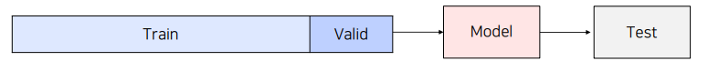
   - 전체 데이터를 8:2로 분리해서 Train / Valid data로 분리
   - 해당 모델로 Inference 진행
   - 장점 : 빠른 속도로 모델 검증 가능, 단점 : 20%의 Valid Data는 학습에 참여하지 못함.

2. K-fold Validation
    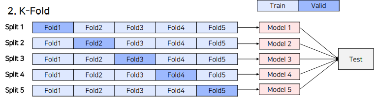
    - Hold out으로 진행했을 때, 학습 데이터가 부족한 단점을 보완하고자, 각 fold별로 검증 진행 후, Ensemble
    - 장점 : 모든 데이터셋이 학습에 참여, 신뢰성, 모델 성능 향상
    - 단점 : K배의 시간 소요, K의 선택이 필요

3. Stratified K-fold  
    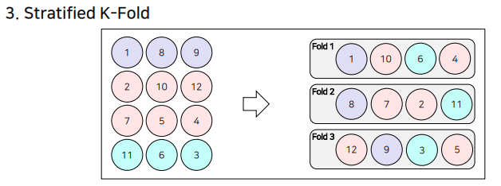
    - class의 Distribution을 고려해서 Fold마다 Class Distribution을 동일하게 Split하는 방식, Class Balance를 맞춰줍니다.

4. Group K-fold
    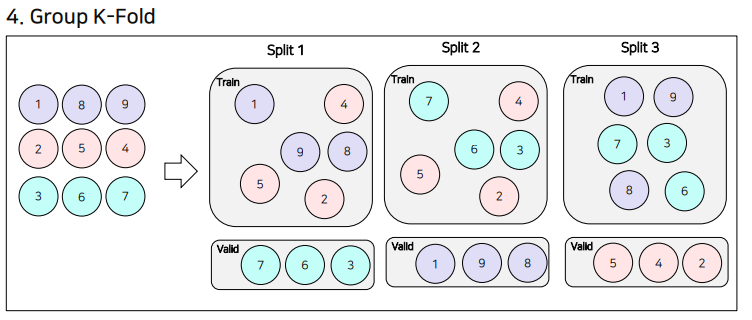
    - 각각의 class (1번 8번 9번 -> 환자1, 2번 5번 4번 -> 환자2, 3번 6번 7번 -> 환자3) 가 다음과 같을 때, Stratified로 한다면, 서로 비슷한 class의 영향을 받는다. 따라서 서로 다른 환자의 class로 valid를 한다.  

#### 2.3 Augmentation

Augmentation Library - Albumentation, Transforms, Autoaugment, Fastaugment

- 데이터 수를 증가
- Generalization 강화
- 성능 향상
- Class Imbalance 문제 해결

Augmentation을 무조건 적용한다해서 성능이 좋아지는 것일까?  
-> 도메인에 맞는, 데이터 상황에 맞는 Augmentation 기법이 필요하다.  
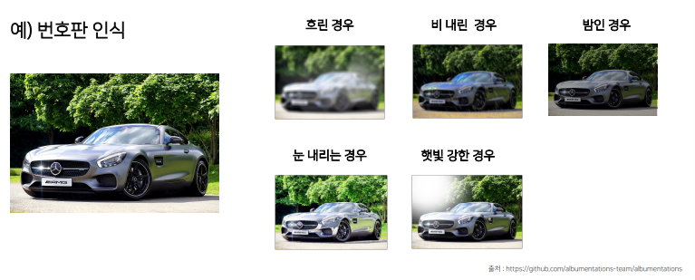

최신 Augmentation 기법?  
1. Cutout
    Cutout은 다음과 같이 Classfication에서 큰 효과를 보인다.  
      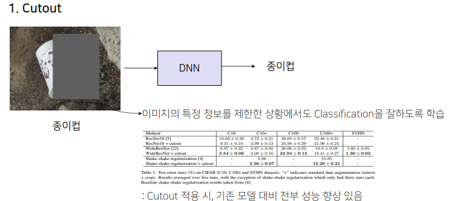
    하지만 실행 때마다 다른 결과가 나오기 때문에, 성능 편차가 존재합니다.  
      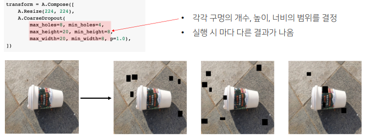
      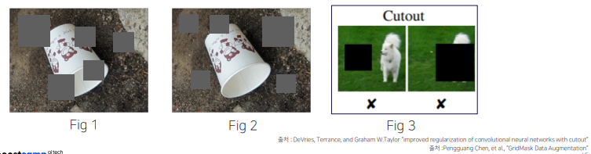
    
2. GridMask
    Cutout의 객체의 중요 부분을 삭제할 수 있다는 단점을 해결하기 위해, 규칙성 있는 박스를 통해 Cutout하는 방안을 제시  
      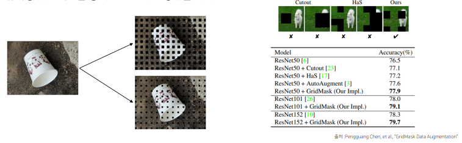

    ```python
    transform = A.Compose([
        A.Resize(224, 224),
        A.GridDropout (ratio=0.2, random_offset=True,  
                     # Mask의 크기를 결정 (df = 0.5), Mask의 시작점이 random한 offset을 가짐
                        holes_number_x=4, holes_number_y=4, p=1.0)  
                     # 각각 x 방향, y 방향 mask의 개수를 결정
    ])
    ```

3. Mixup
    2개의 image를 1개의 image로 합쳐서 학습을 시키는 방법이다.  
      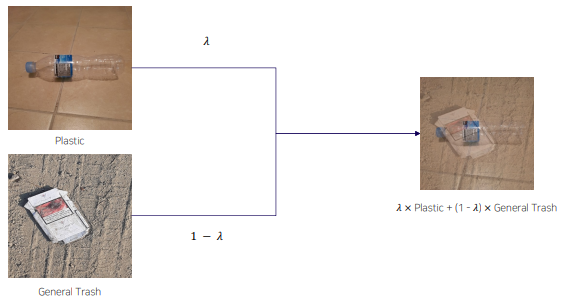

    ```python
    for (img, target) in zip(dataloader):
        x1, y1 = img[0], target[0]
        x2, y2 = img[1], target[1] # One-Hot Encoding 된 y

        alpha = 0.2
        lambda_param = np.random.beta(alpha, alpha)

        image = lambda_param*x1 + (1-lambda_param)*x2
        label = lambda_param*y1 + (1-lambda_param)*y2 # lambda_paramet**e**r의 비율을 가지는 Image와 Label을 만들어준다. 

        optimizer.zero_grad()
        out = net(image)
        loss(out, label).backward()
        optimizer.step()****
    ```

4. CutMix (Clova AI Research)  
    두가지의 사진을 잘라서 붙이는 방법입니다.  
      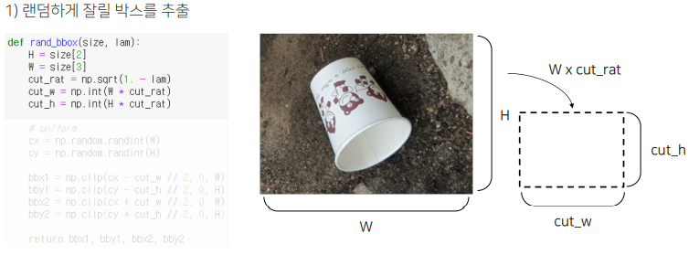
      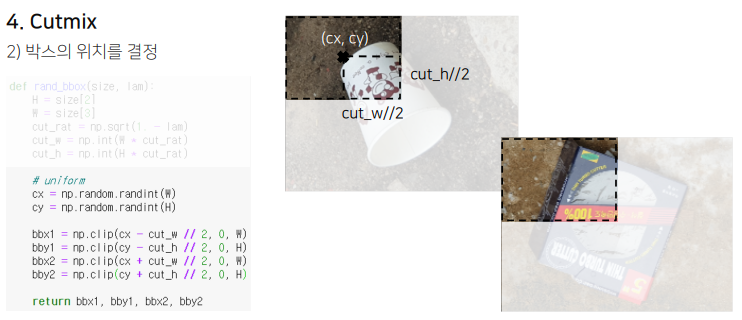

## 2. 고민 내용, 결과 (과제 수행 과정, 결과물 정리)

### 프로젝트 수행

## 3. 피어세션 정리

### 피어세션

## 4. 학습 회고

- 아프니까 하나도 집중이 안된다...  